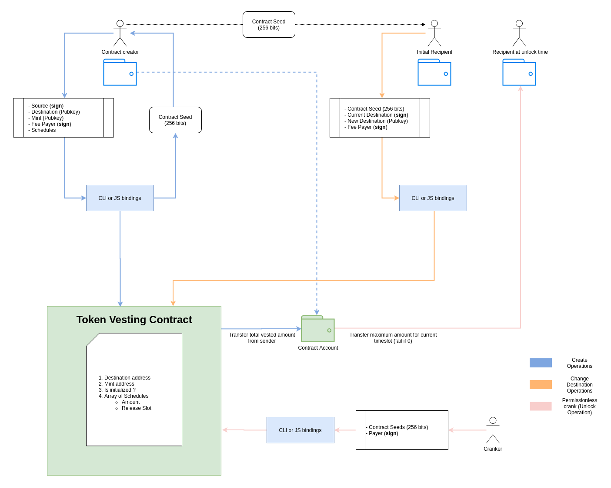

# Solana Vesting Suite

## Overview

- A Solana-based vesting framework for locking and releasing SPL tokens to specified recipients based on slot height.
- Tokens are released by executing a permissionless crank function that transfers funds to the intended address.
- Token accounts follow the [associated token account](https://spl.solana.com/associated-token-account) convention.
- Includes a higher-level "vesting scheduler" contract that manages an array of vesting contracts, enabling complex release logic.
- CLI utilities and scripts are provided for contract deployment and vesting plan creation.
- The recipient public key is reassignable by the current recipient's signer.
- Composed of a Rust-based Solana program and JavaScript bindings with CLI support. The Rust program includes unit tests and fuzz testing.

## Project Layout

- `cli` – Command-line tool to deploy and manage vesting contracts.
- `js` – JavaScript bindings for interacting with the smart contracts.
- `program` – Solana on-chain logic implemented in Rust (BPF-compatible).

